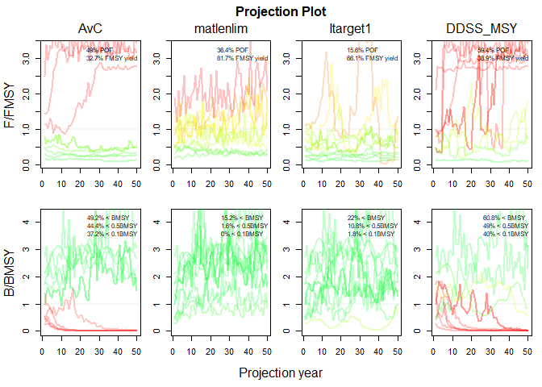

<!-- README.md is generated from README.Rmd. Please edit that file -->

# openMSE 

<!-- badges: start -->

[](https://CRAN.R-project.org/package=openMSE)
[](https://github.com/Blue-Matter/openMSE/actions)
[](https://github.com/blue-matter/openMSE)

[](https://github.com/Blue-Matter/openMSE/actions/workflows/R-CMD-check.yaml)
<!-- badges: end -->

openMSE is an umbrella R package for building operating models,
analyzing fishery data, and conducting Management Strategy Evaluation
(MSE) for a wide range of fisheries.

Installing the openMSE package and loading with `library("openMSE")`
will load the following core packages:

[MSEtool](https://MSEtool.openMSE.com) - the Management Strategy
Evaluation toolkit is the core package in the openMSE collection. It
contains the core functions for constructing operating models,
simulating fishery dynamics, and evaluating the effectiveness of
alternative management strategies using closed-loop simulation testing.

[DLMtool](https://DLMtool.openMSE.com) - the Data-Limited Methods
toolkit is a collection of data-limited management procedures that can
be evaluated using MSE. DLMtool requires the MSEtool package as a
dependency, and all MSEtool functions will be available when DLMtool is
loaded into an R session.

[SAMtool](https://SAMtool.openMSE.com) - the Stock Assessment Methods
toolkit is a collection of assessment methods and management procedures
that have been developed for more data-intensive applications. This
package includes the Rapid Conditioning Model for conditioning operating
models in data-moderate and data-rich fisheries. SAMtool requires the
MSEtool package as a dependency, and all MSEtool functions will be
available when SAMtool is loaded into an R session.

You can learn more about the openMSE packages at the [openMSE
documentation site](https://openMSE.com).

## Installation

You can install the released version of openMSE from
[CRAN](https://CRAN.R-project.org) with:

``` r
install.packages("openMSE")
```

And the development version from [GitHub](https://github.com/) with:

``` r
# install.packages("devtools")
devtools::install_github("Blue-Matter/openMSE")
```

## Example

The `demo` function runs an example MSE using three data-limited
management procedures from `DLMtool` and one stock assessment model from
`SAMtool`, and demonstrates some example plotting output:

``` r
library(openMSE)
#> Loading required package: MSEtool
#> Loading required package: snowfall
#> Loading required package: snow
#> Loading required package: DLMtool
#> Loading required package: SAMtool
#> 
#> Attaching package: 'SAMtool'
#> The following object is masked from 'package:stats':
#> 
#>     simulate
#> 
#> Attaching package: 'openMSE'
#> The following object is masked from 'package:SAMtool':
#> 
#>     userguide
#> The following object is masked from 'package:utils':
#> 
#>     demo
demo()
#> Running an example MSE with 10 simulations
#> Using four example management procedures:
#> 1. AvC - TAC set at the average catch (see ?DLMtool::AvC)
#> 2. matlenlim - Size limit set at the length of maturity (see 
#> ?DLMtool::matlenlim)
#> 3. Itarget1 - TAC set using an Index Target method (see 
#> ?DLMtool::Itarget1)
#> 4. DDSS_MSY - TAC set using a state-space delay difference model with a 
#> TAC recommendation based on fishing at FMSY (see ?SAMtool::DDSS_MSY)
#> ℹ Checking OM for completeness
#> ✔ Loading operating model
#> ✔ Optimizing for user-specified movement
#> ✔ Calculating MSY reference points for each year
#> ✔ Optimizing for user-specified depletion in last historical year
#> ✔ Calculating historical stock and fishing dynamics
#> ✔ Calculating per-recruit reference points
#> ✔ Calculating B-low reference points
#> ✔ Calculating reference yield - best fixed F strategy
#> ✔ Simulating observed data
#> ✔ Running forward projections
#> ✔ 1 / 4  Running MSE for AvC
#>   |==                                                | 2 % ~01s            |===                                               | 4 % ~01s            |====                                              | 6 % ~01s            |=====                                             | 8 % ~01s            |======                                            | 10% ~02s            |=======                                           | 12% ~02s            |========                                          | 14% ~01s            |=========                                         | 16% ~01s            |==========                                        | 18% ~02s            |===========                                       | 20% ~02s            |============                                      | 22% ~01s            |=============                                     | 24% ~01s            |==============                                    | 27% ~02s            |===============                                   | 29% ~02s            |================                                  | 31% ~02s            |=================                                 | 33% ~02s            |==================                                | 35% ~02s            |===================                               | 37% ~02s            |====================                              | 39% ~01s            |=====================                             | 41% ~01s            |======================                            | 43% ~01s            |=======================                           | 45% ~01s            |========================                          | 47% ~01s            |=========================                         | 49% ~01s            |==========================                        | 51% ~01s            |===========================                       | 53% ~01s            |============================                      | 55% ~01s            |=============================                     | 57% ~01s            |==============================                    | 59% ~01s            |===============================                   | 61% ~01s            |================================                  | 63% ~01s            |=================================                 | 65% ~01s            |==================================                | 67% ~01s            |===================================               | 69% ~01s            |====================================              | 71% ~01s            |=====================================             | 73% ~01s            |======================================            | 76% ~01s            |=======================================           | 78% ~01s            |========================================          | 80% ~00s            |=========================================         | 82% ~00s            |==========================================        | 84% ~00s            |===========================================       | 86% ~00s            |============================================      | 88% ~00s            |=============================================     | 90% ~00s            |==============================================    | 92% ~00s            |===============================================   | 94% ~00s            |================================================  | 96% ~00s            |================================================= | 98% ~00s            |==================================================| 100% elapsed=02s
#> ✔ 2 / 4 Running MSE for matlenlim
#>   |==                                                | 2 % ~05s            |===                                               | 4 % ~03s            |====                                              | 6 % ~03s            |=====                                             | 8 % ~02s            |======                                            | 10% ~04s            |=======                                           | 12% ~03s            |========                                          | 14% ~03s            |=========                                         | 16% ~03s            |==========                                        | 18% ~03s            |===========                                       | 20% ~03s            |============                                      | 22% ~03s            |=============                                     | 24% ~03s            |==============                                    | 27% ~03s            |===============                                   | 29% ~03s            |================                                  | 31% ~03s            |=================                                 | 33% ~02s            |==================                                | 35% ~03s            |===================                               | 37% ~02s            |====================                              | 39% ~02s            |=====================                             | 41% ~02s            |======================                            | 43% ~02s            |=======================                           | 45% ~02s            |========================                          | 47% ~02s            |=========================                         | 49% ~02s            |==========================                        | 51% ~02s            |===========================                       | 53% ~02s            |============================                      | 55% ~02s            |=============================                     | 57% ~02s            |==============================                    | 59% ~02s            |===============================                   | 61% ~02s            |================================                  | 63% ~01s            |=================================                 | 65% ~01s            |==================================                | 67% ~01s            |===================================               | 69% ~01s            |====================================              | 71% ~01s            |=====================================             | 73% ~01s            |======================================            | 76% ~01s            |=======================================           | 78% ~01s            |========================================          | 80% ~01s            |=========================================         | 82% ~01s            |==========================================        | 84% ~01s            |===========================================       | 86% ~01s            |============================================      | 88% ~00s            |=============================================     | 90% ~00s            |==============================================    | 92% ~00s            |===============================================   | 94% ~00s            |================================================  | 96% ~00s            |================================================= | 98% ~00s            |==================================================| 100% elapsed=04s
#> ✔ 3 / 4 Running MSE for Itarget1
#>   |==                                                | 2 % ~01s            |===                                               | 4 % ~01s            |====                                              | 6 % ~00s            |=====                                             | 8 % ~01s            |======                                            | 10% ~02s            |=======                                           | 12% ~02s            |========                                          | 14% ~01s            |=========                                         | 16% ~01s            |==========                                        | 18% ~02s            |===========                                       | 20% ~01s            |============                                      | 22% ~01s            |=============                                     | 24% ~01s            |==============                                    | 27% ~01s            |===============                                   | 29% ~01s            |================                                  | 31% ~01s            |=================                                 | 33% ~01s            |==================                                | 35% ~01s            |===================                               | 37% ~01s            |====================                              | 39% ~01s            |=====================                             | 41% ~01s            |======================                            | 43% ~01s            |=======================                           | 45% ~01s            |========================                          | 47% ~01s            |=========================                         | 49% ~01s            |==========================                        | 51% ~01s            |===========================                       | 53% ~01s            |============================                      | 55% ~01s            |=============================                     | 57% ~01s            |==============================                    | 59% ~01s            |===============================                   | 61% ~01s            |================================                  | 63% ~01s            |=================================                 | 65% ~01s            |==================================                | 67% ~01s            |===================================               | 69% ~01s            |====================================              | 71% ~01s            |=====================================             | 73% ~01s            |======================================            | 76% ~00s            |=======================================           | 78% ~00s            |========================================          | 80% ~00s            |=========================================         | 82% ~00s            |==========================================        | 84% ~00s            |===========================================       | 86% ~00s            |============================================      | 88% ~00s            |=============================================     | 90% ~00s            |==============================================    | 92% ~00s            |===============================================   | 94% ~00s            |================================================  | 96% ~00s            |================================================= | 98% ~00s            |==================================================| 100% elapsed=02s
#> ✔ 4 / 4 Running MSE for DDSS_MSY
#>   |==                                                | 2 % ~43s            |===                                               | 4 % ~21s            |====                                              | 6 % ~14s            |=====                                             | 8 % ~11s            |======                                            | 10% ~18s            |=======                                           | 12% ~15s            |========                                          | 14% ~13s            |=========                                         | 16% ~11s            |==========                                        | 18% ~15s            |===========                                       | 20% ~13s            |============                                      | 22% ~12s            |=============                                     | 24% ~10s            |==============                                    | 27% ~13s            |===============                                   | 29% ~12s            |================                                  | 31% ~11s            |=================                                 | 33% ~10s            |==================                                | 35% ~12s            |===================                               | 37% ~11s            |====================                              | 39% ~10s            |=====================                             | 41% ~09s            |======================                            | 43% ~11s            |=======================                           | 45% ~10s            |========================                          | 47% ~09s            |=========================                         | 49% ~09s            |==========================                        | 51% ~10s            |===========================                       | 53% ~09s            |============================                      | 55% ~09s            |=============================                     | 57% ~08s            |==============================                    | 59% ~09s            |===============================                   | 61% ~08s            |================================                  | 63% ~08s            |=================================                 | 65% ~07s            |==================================                | 67% ~08s            |===================================               | 69% ~07s            |====================================              | 71% ~07s            |=====================================             | 73% ~06s            |======================================            | 76% ~06s            |=======================================           | 78% ~06s            |========================================          | 80% ~05s            |=========================================         | 82% ~04s            |==========================================        | 84% ~05s            |===========================================       | 86% ~04s            |============================================      | 88% ~03s            |=============================================     | 90% ~03s            |==============================================    | 92% ~02s            |===============================================   | 94% ~02s            |================================================  | 96% ~01s            |================================================= | 98% ~01s            |==================================================| 100% elapsed=32s
#> MSE Complete 
#> 
#> Plotting Results using example Performance Metrics: 
#> 
#> Trade-Off Plot 
#> 
#> Projection Plot 
#> 
#> Kobe Plot
```


