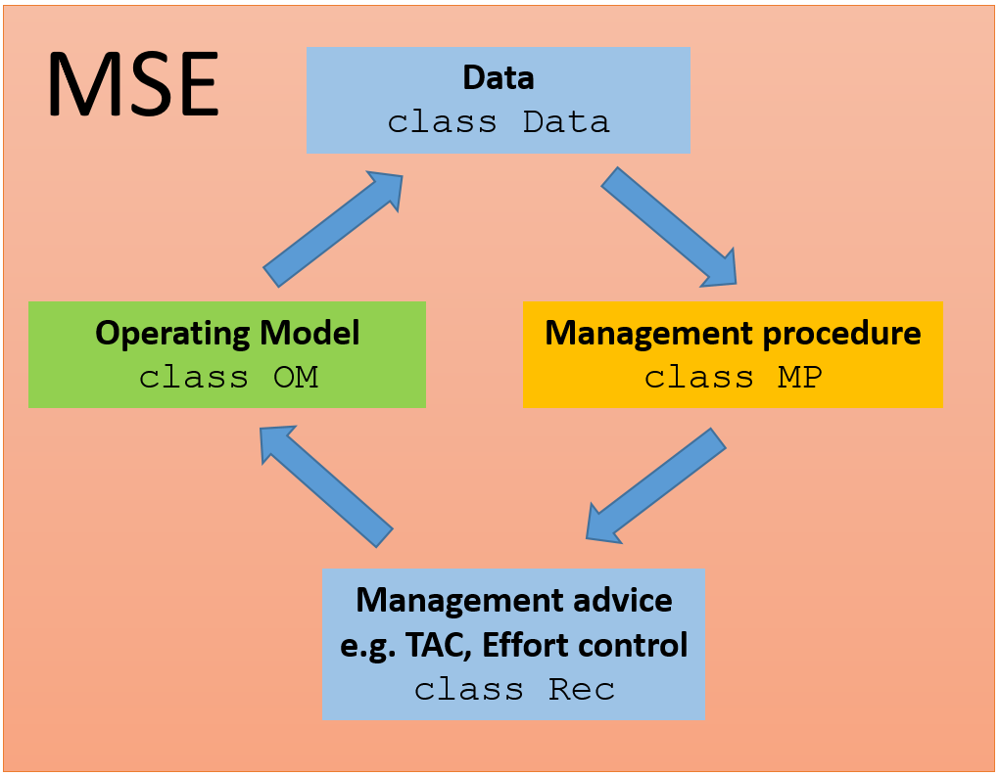
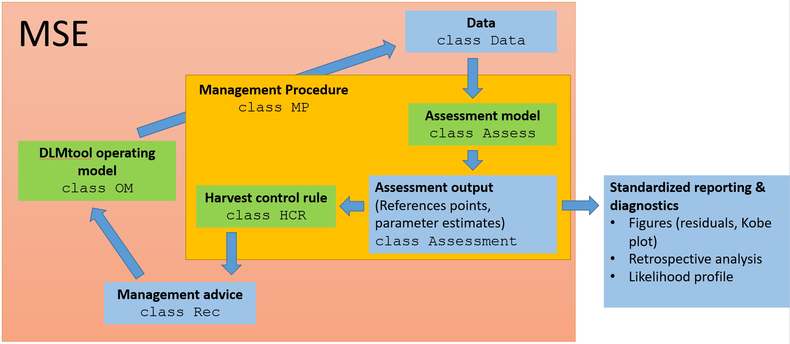
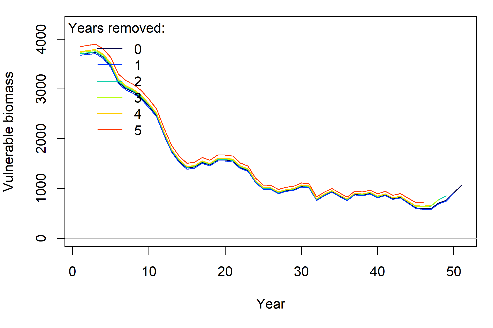
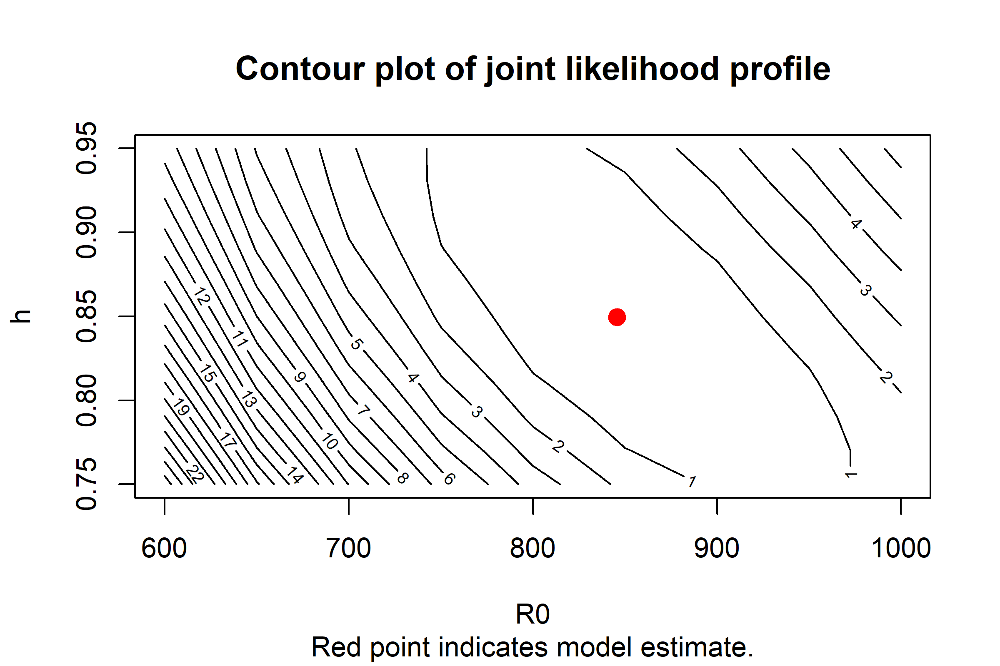
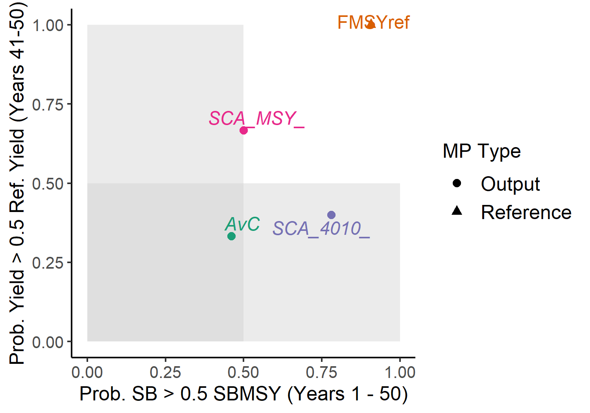
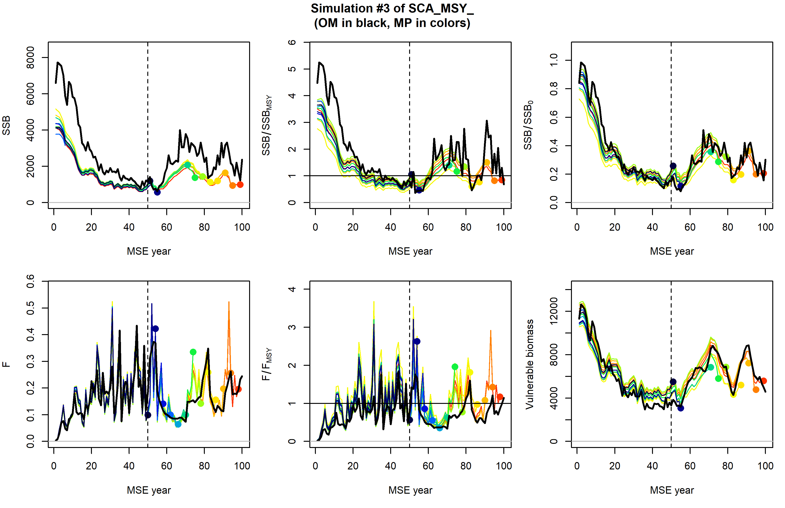

```{r echo = FALSE}
library(SAMtool, quietly = TRUE)
```

# Introduction to SAMtool

As part of openMSE, SAMtool implements closed-loop simulation testing of management procedures (MP), a process used in management strategy evaluation (MSE). The components of the operating model (OM) for conducting MSEs for data-rich stocks is wholly contained within MSEtool, but SAMtool provides the tools for implementing additional features to facilitate model-based MPs. Whereas DLMtool is primarily designed for testing data-limited MPs, SAMtool provides an object-oriented framework for building out data-rich MPs, which typically combine an assessment model with a harvest control rule (HCR) to provide a catch recommendation. MPs created by SAMtool are designed to be used with the operating model of MSEtool through the `runMSE` function. 

The overall structure of a closed-loop simulation for a MSE in MSEtool can be described through the classes deployed in the package. An operating model (class __OM__ object) parameterizes the stock (biology), fleet, observation, and implementation dynamics of the MSE. To begin the MSE, the __OM__ object generates the data to be used for a management procedure and stores them in an object of class __Data__. A function of class __MP__ uses the __Data__ object and returns an object of class __Rec__ containing the management recommendations, e.g., some combination of spatial closures and size, effort and catch limits. Candidate MPs should not see the operating model and interacts solely with data simulated in the __Data__ object. From the management recommendations, the __OM__ object is updated and the process is successively repeated as the operating model projects forward in time. The output from the closed-loop simulation is returned in an object of class __MSE__, from which summary statistics can be calculated.



_Figure 1: Design of MSEtool package for management strategy evaluations_


## Overview of SAMtool

To facilitate a standardized design for data-rich MPs, SAMtool creates new classes to build out the __MP__ class. SAMtool uses functions of class __Assess__ and __HCR__ for an assessment model and harvest control rule, respectively. An __MP__ class function can be made from these functions to be tested within the MSEtool framework. 

Additionally, __Assess__ functions can be used in an assessment-only context (external to closed-loop simulation). Output of an __Assess__ function can be used to provide standardized stock assessment reporting and diagnostics, such as Kobe plots, likelihood profiles for parameter estimates, and retrospective analyses of time series estimates of biomass, fishing mortality, recruitment, etc. 



_Figure 2: Design of SAMtool package for building management procedures from assessment models and harvest control rules for closed-loop simulation with the MSEtool package. Assess and HCR functions and the Assessment object are unique to SAMtool, but work within the framework of MSEtool. Separate functions are also available for standardized reporting of output from assessment models in a stock assessment setting._

## Additional features
SAMtool provides a conditioning model (RCM, for Rapid Conditioning Model) for generating operating models fitted to data. 

Articles with the description of the [assessment models](https://openmse.com/features-assessment-models/) and the [RCM](https://openmse.com/tutorial-rcm/) are available on the [openMSE](https://openmse.com/) website.

To support multiple-area operating models, the `simmov` function estimates the movement matrix based on the prescribed number of areas, biomass distribution among areas in unfished conditions, and the probability of staying in each area in the next time step.

# Assessment models

Assessment models in SAMtool are functions of class __Assess__. Currently, the following assessment functions are available: 

- `DD_TMB` (Delay-Difference model and its state-space counterpart, `DD_SS`)
- `cDD` (Continuous Delay-Differential model and its state-space counterpart, `cDD_SS`)
- `SP` (Surplus Production model and its state-space counterpart, `SP_SS`)
- `SCA` (Statistical Catch at age model and variants for time varying M: `SCA_RWM` and `SCA_DDM`)
- `SSS` (Simple Stock Synthesis implementation with fixed terminal depleton assumption)
- `VPA` (Virtual Population Analysis)

These functions take a __Data__ object as an argument and return an object of class __Assessment__, for example,

```{r, eval = FALSE}
SCA_assessment <- SCA(Data = MSEtool::SimulatedData, fix_h = FALSE, ...)
```
where `...` are model configuration arguments. For example, in this SCA model we will try to estimate steepness instead of fixing it to value specified in the __Data__ object.

The __Assessment__ object contains the raw output from the TMB estimation model, optimization results from `nlminb`, and parameter estimates with covariance matrix. If applicable, time series estimates of total biomass, vulnerable biomass, spawning stock biomass, fishing mortality and/or exploitation rate, as well as their corresponding MSY and unfished reference points. The __Assessment__ object also reports likelihood values and predicted values for the data used in the assessment model. The object documentation for the __Assessment__ object can be obtained through:

```{r, eval = FALSE}
class?Assessment
```

Further details regarding parameterization, e.g., fixing parameters, and tuning, e.g., adjusting start parameters, are provided on the [SAMtool function documentation page](https://samtool.openmse.com/reference/index.html).


## Reporting and diagnostic functions

Generic functions `summary` and `plot` are available for __Assessment__ objects. The `summary` function returns a list of estimated current stock status ($F/F_{MSY}$ , $B/B_{MSY}$ in the terminal year), input parameters to the model, derived quantities, and parameter estimates. The `plot` function generates a Markdown report with time series figures of data, fitted data, and estimated quantities (e.g., biomass and recruitment).

```{r, eval = FALSE}
plot(SCA_assessment) # By default, also saves figures in a temporary directory for viewing. The directory can be changed to a user's filespace of choice
summary(SCA_assessment)
```
```{r, echo = FALSE}
SCA_assessment <- SCA(x = 3, Data = MSEtool::SimulatedData, fix_h = FALSE)
summary(SCA_assessment)[1:3]
```

Two diagnostic functions are available: `retrospective` for retrospective analyses (re-running the model by sequentially removing terminal years of data) and `profile` for profiling the likelihood function over a grid of parameters.

```{r, eval = FALSE}
retrospective(SCA_assessment, nyr = 5) # Retrospective analysis going back 5 years from current year
profile(SCA_result, R0 = seq(0.75, 1.25, 0.025), h = seq(0.95, 1, 2.5e-3)) # Joint profile over grid of R0 and steepness
```

```{r, echo = FALSE}
retrospective(SCA_assessment, nyr = 5, figure = FALSE)
```


_Figure 3: Retrospective trends in the SCA assessment fit and table of associated Mohn's rho above._



_Figure 4: Joint profile of R0 and steepness from the SCA assessment model. Contours indicate change in likelihood values from minimum (red point)._

# Harvest control rules (HCRs)

Harvest control rules in SAMtool are functions of class __HCR__ that take an object of class __Assessment__ and return an object of class __Rec__. Example __HCR__ output control functions (catch limits) are: `HCR_MSY`, `HCR40_10`, and `HCR60_20`. `HCR_MSY` prescribes the TAC to be the catch predicted with fishing at the estimated $F_{MSY}$, i.e., the product of $F_{MSY}$ and estimated vulnerable biomass in the year following the assessment, while `HCR40_10` and `HCR60_20` are ramped control rules which reduce the $F/F_{MSY}$ for the catch advice as a function of spawning depletion $SSB/SSB_0$.

```{r, echo = FALSE, fig.width = 5, fig.height = 4}
par(mar = c(5,5,3,1))
Brel <- seq(0, 1, length.out = 200)
plot(Brel, SAMtool::HCRlin(Brel, 0.1, 0.4), xlab = expression(Estimated~~SSB/SSB[0]), ylab = "TAC adjustment factor \n(proportion of FMSY catch)", main = "40-10 harvest control rule", type = "l", col = "blue")
abline(v = c(0.1, 0.4), col = "red", lty = 2)
```

_Figure 5: The 40-10 harvest control rule prescribes an additional reduction in the TAC based on estimated spawning depletion._

# Model-based MPs in closed-loop simulation

## Creating MPs

SAMtool comes with a set of pre-built model-based MPs:
```{r}
avail("MP", package = "SAMtool")
```

These MPs use an assessment model and a harvest control rule to come up with a management recommendation (TAC).

The `make_MP` function is a convenient way to stitch together additional MPs from an assessment model and HCR. This is handy if an assessment model with a different configuration than the default is needed (for example, specify dome vulnerability instead of logistic vulnerability in `SCA`) or a different harvest control rule is desired. The resulting function can then be passed to `MSEtool::runMSE()` as a management procedure.

```{r, eval = FALSE}
SCA_MSY_ <- make_MP(SCA, HCR_MSY, diagnostic = "full")
SCA_4010_ <- make_MP(SCA, HCR40_10, diagnostic = "full")
myMSE <- MSEtool::runMSE(OM = MSEtool::testOM, MPs = c("FMSYref", "AvC", "SCA_MSY_", "SCA_4010_"))
MSEtool::Tplot(myMSE)
```



_Figure 6. Tradeoff plot between long-term catch and biomass of the SCA with two different HCRs, an average catch MP, and the FMSY reference (perfect FMSY implementation) MP._

Model configuration arguments can be passed through `...` in `make_MP` when the MP is made. For example, the Ricker stock-recruitment relationship can be used in the SCA instead of the default Beverton-Holt relationship and steepness can be fixed instead of estimated by passing argument `SR = "Ricker"` and `fix_h = TRUE`, respectively:

```{r, eval = FALSE}
SCA_MSY_Ricker_fixsteep <- make_MP(SCA, HCR_MSY, SR = "Ricker", fix_h = TRUE)
```

This MP will call `SCA(..., SR = "Ricker", fix_h = TRUE)` when fitting the assessment model.

## Diagnostic of assessment models in MSE

Three functions are designed to evaluate the performance of __Assess__ models in MSE: `prelim_AM`, `diagnostic`, and `retrospective_AM` (where _AM_ stands for "assessment in MSE").

`prelim_AM` is designed to evaluate the configuration of the assessment model before running the closed-loop simulation. Given an operating model, this function generates data from the historical period of the MSE, applies the assessment model to those data, then returns the convergence rate of the model. Low convergence rate could be be indicative of an OM for which the assessment model behaves pathologically. A list of __Assessment__ objects are returned and can be used for troubleshooting. Additional arguments are passed to the __Assess__ function via `...`:

```{r, eval = FALSE}
prelim_AM(MSEtool::testOM, DD_TMB, ...)
#> Running DD_TMB with 3 simulations for testOM.
#> Assessments complete.
#> Total time to run 3 assessments: 0.1 seconds
#> 0 of 3 simulations (0%) failed to converge.
```

By default, assessment model results are not saved during the MSE. However, this feature can be turned on in `make_MP`, as shown in the following example:

```{r, eval = FALSE}
SCA_MSY_ <- make_MP(SCA, HCR_MSY, diagnostic = "full")
```

By setting `diagnostic = "min"` (the default option), simple diagnostic information (e.g., convergence) from each model fit in closed-loop simulation is returned in the MSE object. With `diagnostic = "full"`, biomass and F estimates are also returned from each model fit in addition to the diagnostics.

The `diagnostic` function plots the convergence information, and `retrospective_AM` plots the assessment model's retrospective patterns (for a single simulation within the closed-loop simulation).

```{r, eval = FALSE}
diagnostic(myMSE)
retrospective_AM(myMSE, MP = "SCA_MSY_", sim = 3)
```


_Figure 7. Convergence diagnostics (return by TMB objects and nlminb function) for the DD_MSY MP during the MSE. Here, the assessment model was applied beginning in year 50 of the MSE and repeated every 4th year. In SAMtool, convergence is defined by a positive-definite Hessian matrix (top left figure). In the case of non-convergence, the previous management recommendation is used._



_Figure 8. Retrospective analysis of the SCA in the SCA_MSY MP during the MSE for simulation #3. Operating model (true) values of spawning biomass (SSB), relative spawning biomass (SSB_SSBMSY), spawning biomass depletion (SSB_SSB0), fishing mortality (F), relative F (F_FMSY), and vulnerable biomass (VB) are in dark black. Colored lines indicate model estimates sequentially over the projection years. In simulation #3, the SCA tends to underestimate SSB (top left sub-plot)._

Once it is determined that the SAMtool assessment models are performing adequately (no major convergence issues), then the performance of the MPs that use these models can be evaluated using performance metrics relevant to management.

